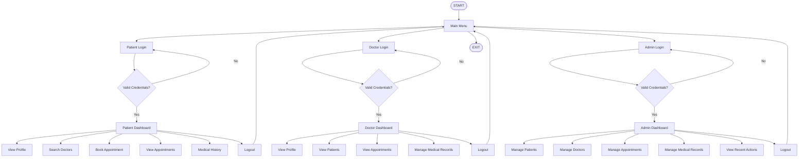

PATIENT MANAGEMENT SYSTEM - JAVA + DSA ONLY
===========================================

Console application. No GUI. No other programming language.

MAIN FEATURES
1. Separate Patient Login
2. Separate Doctor Login
3. Patient self-registration with name, age, gender, contact, username and password
4. Doctor self-registration with name, age, gender, specialization, availability, username and password
5. Admin login
6. Admin can VIEW, EDIT and DELETE every patient detail
7. Admin can VIEW, EDIT and DELETE every doctor detail
8. Admin can VIEW, EDIT and DELETE appointments
9. Admin can VIEW, EDIT and DELETE medical records
10. Patients and doctors have their own accounts
11. DSA is actually used

DSA USED
- ArrayList: patients, doctors, appointments
- LinkedList: medical records
- HashMap: ID and username account lookup
- Queue: normal pending appointments
- PriorityQueue: emergency pending appointments
- Stack: recent actions
- Merge Sort: patient sorting by name
- HashSet: avoid duplicate patient display for doctor

# ▶️ HOW TO COMPILE

Open Command Prompt in the **project root folder**.

The project root is the folder containing:

```text
README.md
.gitignore
src/
```

First, create a list of all Java source files:

```cmd
dir /s /b src\*.java > sources.txt
```

Then compile all Java files:

```cmd
javac -d out @sources.txt
```

If compilation is successful, run the program:

```cmd
java -cp out Main
```

The application will start in the console.

## SAMPLE ACCOUNTS


Patient: jhansi 
password: jhansi123

Patient: santhi 
password: santhi123

Doctor: bhavya 
password: bhavya123

Doctor: vyshnavi 
password: vyshnavi123

Admin: admin 
password: admin123

IMPORTANT
Data is stored in Java memory, so it resets when the program closes.


## Project Development Process
#Step 1

Requirement analysis was performed.

The main roles were identified as:

Patient
Doctor
Administrator

#Step 2

The system architecture and modules were designed.

#Step 3

Java classes were created for:

Patient
Doctor
Appointment
Medical Record

#Step 4

DSA structures were integrated to efficiently manage the information.

#Step 5

Separate authentication systems were created for patients, doctors and administrators.

#Step 6

Patient and doctor registration functionality was implemented.

#Step 7

Administrator CRUD operations were implemented.

CRUD represents:

Create
Read
Update
Delete

#Step 8

Appointment and medical record management were implemented.

Step 9

The project was compiled and tested through the Java command line.

## Conclusion

The Patient Management System demonstrates the practical implementation of Java and Data Structures & Algorithms in a real-world healthcare management scenario.

The system manages multiple users, patient information, doctor information, appointments and medical records while demonstrating important DSA concepts such as ArrayList, LinkedList, HashMap, Queue, PriorityQueue, Stack, HashSet and Merge Sort.


## PROGRAM FLOW


                  EXIT


